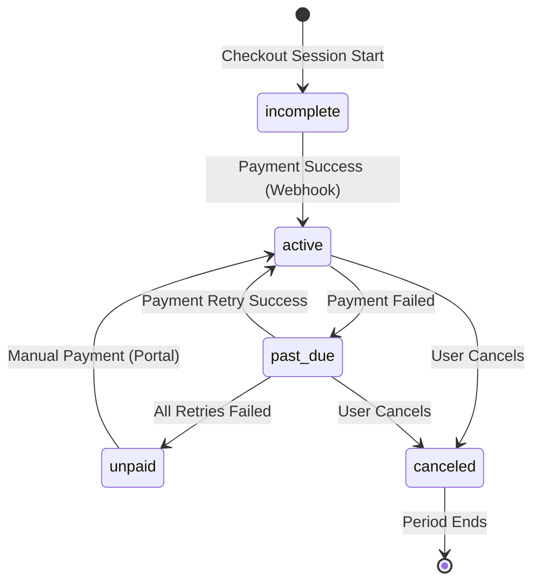
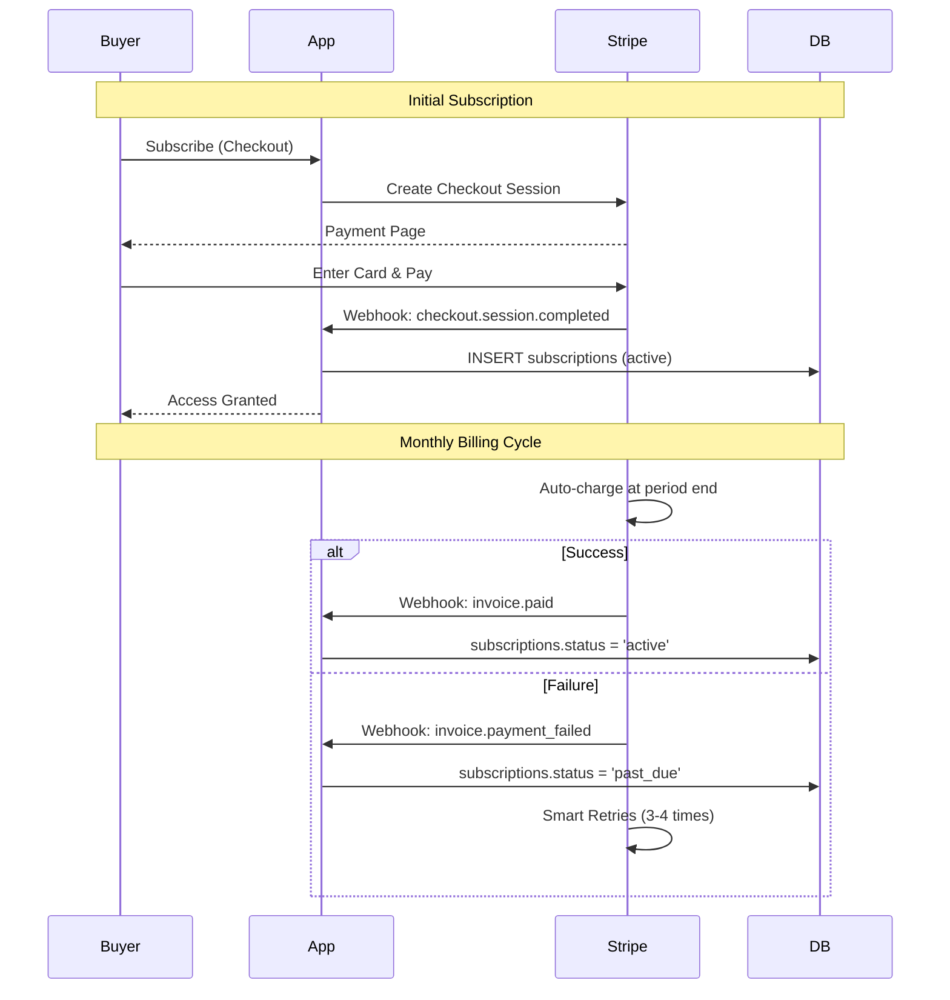
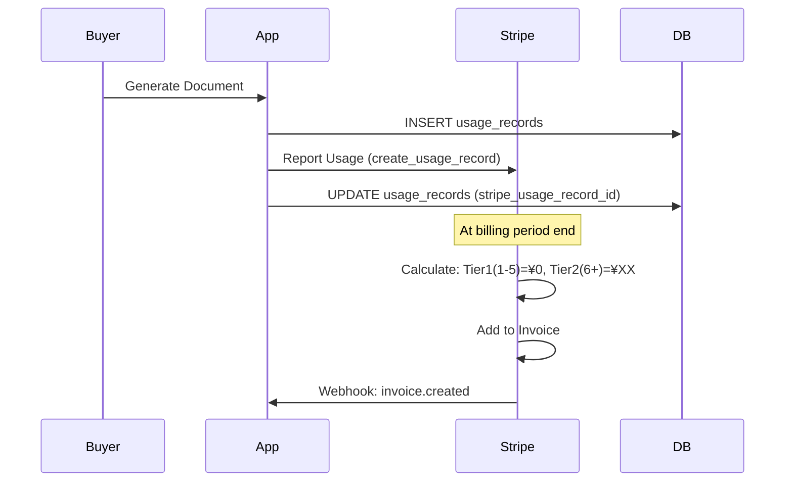
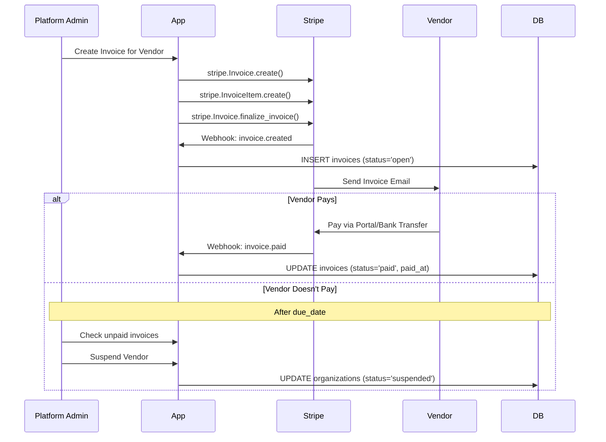
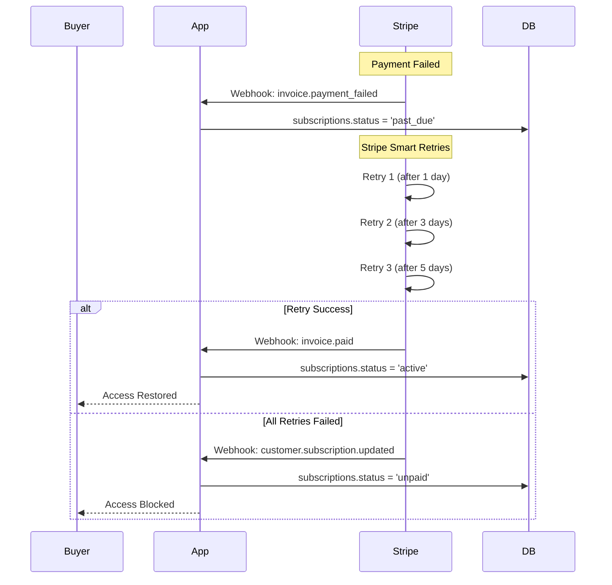
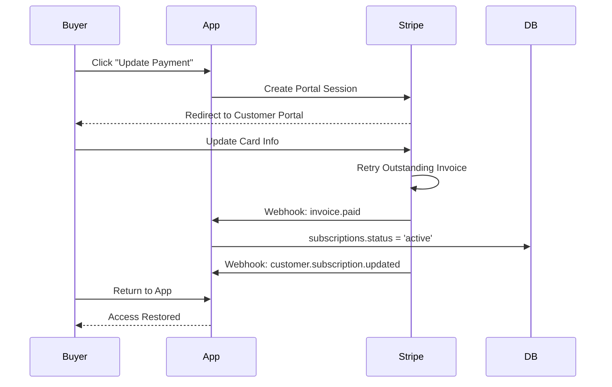
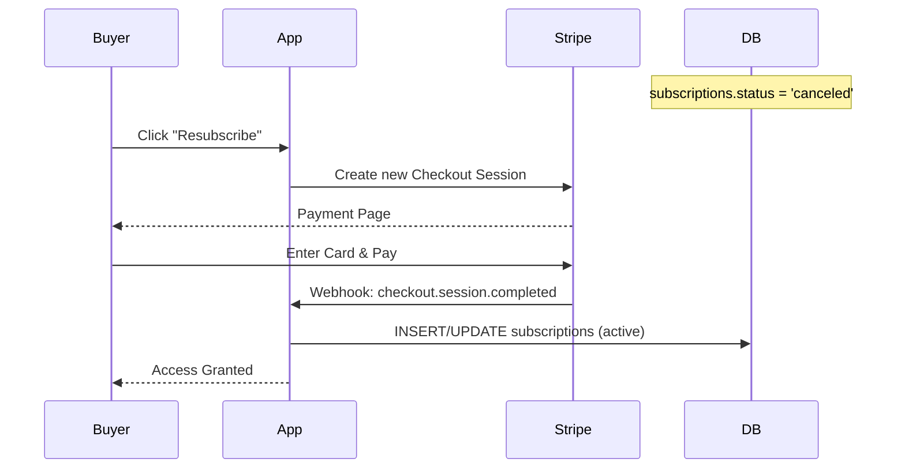

# 6. Billing & Payments / 決済・請求

[← Back to Index](./index.md)

---

## 6.1 Subscription States / サブスクリプション状態遷移

**States (subscriptions.status):**
- `active`: 利用可能
- `past_due`: 支払い失敗（猶予期間中/アクセス可または制限）
- `unpaid`: 支払い失敗（停止中/アクセス不可）
- `canceled`: 解約済み（期間終了まで利用可、その後停止）
- `incomplete`: 決済フロー途中



---

## 6.2 Buyer Billing Model / Buyer 決済モデル

### Overview / 概要

| 項目 | 内容 |
|------|------|
| 基本料金 | サブスクリプション（月額固定） |
| 従量課金 | ドキュメント生成数（月5件無料、6件目〜有料） |
| 決済方式 | カード自動課金 |
| アクセス制御 | 自動（`subscriptions.status` で判定） |

### Billing Flow / 課金フロー



### Metered Billing / 従量課金



**Stripe Price Configuration:**
```
Product: Document Generation
Pricing: Graduated (段階料金)
├── Tier 1: First 5 units @ ¥0
└── Tier 2: Additional units @ ¥XX each
```

---

## 6.3 Vendor Billing Model / Vendor 決済モデル

### Overview / 概要

| 項目 | 内容 |
|------|------|
| 課金対象 | プラットフォーム利用料など |
| 決済方式 | 請求書払い（Invoice） |
| 支払い期限 | 30日（設定可能） |
| アクセス制御 | 手動（Platform Admin が `organizations.status` を更新） |

### Invoice Flow / 請求フロー



---

## 6.4 Payment Failure & Recovery / 決済失敗と復旧

### Buyer: Automatic Recovery / 自動復旧



### Buyer: Manual Recovery (Customer Portal) / 手動復旧



### Buyer: Re-subscription After Cancellation / 解約後の再契約



---

## 6.5 Access Control Logic / アクセス制御ロジック

### Buyer Access Control / Buyer アクセス制御

```python
# Pseudo-code for Buyer access check
def check_buyer_access(organization_id):
    subscription = get_subscription(organization_id)

    if subscription is None:
        return AccessDenied("No subscription")

    if subscription.status == 'active':
        return AccessGranted()

    if subscription.status == 'past_due':
        grace_period = timedelta(days=SUBSCRIPTION_GRACE_PERIOD_DAYS)
        if datetime.now() < subscription.current_period_end + grace_period:
            return AccessGranted(warning="Payment past due")
        else:
            return AccessDenied("Payment required")

    if subscription.status in ['unpaid', 'canceled', 'incomplete']:
        return AccessDenied("Subscription inactive")
```

**Environment Variables:**
```env
SUBSCRIPTION_GRACE_PERIOD_DAYS=7
DOCUMENT_FREE_TIER_LIMIT=5
```

### Vendor Access Control / Vendor アクセス制御

```python
# Pseudo-code for Vendor access check
def check_vendor_access(organization_id):
    organization = get_organization(organization_id)

    if organization.status == 'active':
        return AccessGranted()

    if organization.status == 'suspended':
        return AccessDenied("Account suspended - contact support")

    if organization.status == 'pending':
        return AccessDenied("Application pending approval")
```

---

## 6.6 Webhook Events / Webhook イベント一覧

| Event | Description | App Action |
|-------|-------------|------------|
| `checkout.session.completed` | 新規契約完了 | INSERT subscriptions |
| `customer.subscription.created` | サブスク作成 | INSERT/UPDATE subscriptions |
| `customer.subscription.updated` | サブスク更新 | UPDATE subscriptions |
| `customer.subscription.deleted` | サブスク削除 | UPDATE subscriptions (canceled) |
| `invoice.created` | 請求書作成 | INSERT invoices |
| `invoice.paid` | 支払い完了 | UPDATE invoices, subscriptions |
| `invoice.payment_failed` | 支払い失敗 | UPDATE subscriptions (past_due) |
| `payment_method.automatically_updated` | カード自動更新 | Log only |

---

## 6.7 Summary: Buyer vs Vendor / まとめ

| | Buyer | Vendor |
|---|-------|--------|
| 決済方式 | サブスクリプション + 従量課金 | 請求書払い |
| 課金タイミング | 自動（カード決済） | 手動（請求書送付） |
| アクセス制御 | **自動** (`subscriptions.status`) | **手動** (`organizations.status`) |
| 制御主体 | システム | Platform Admin |
| 復旧方法 | Customer Portal or Checkout | Platform Admin が手動復旧 |

---

[← Previous: Notifications](./notifications.md) | [Next: Admin Operations →](./admin.md)
