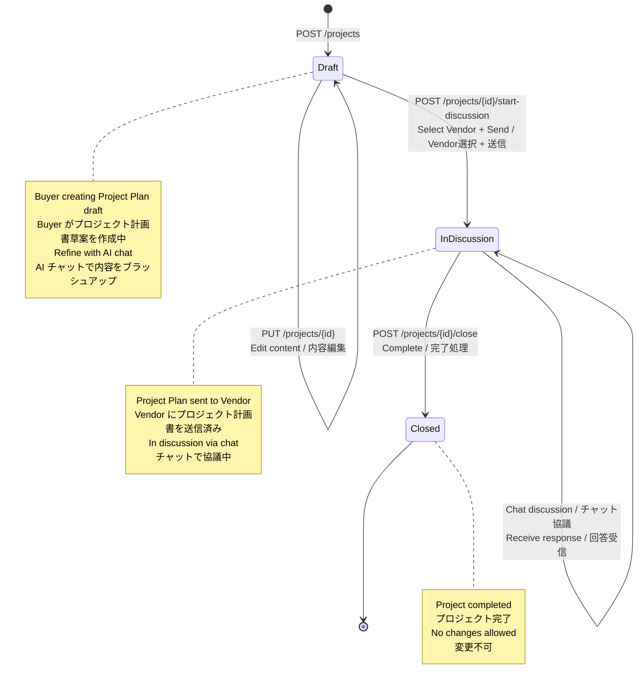
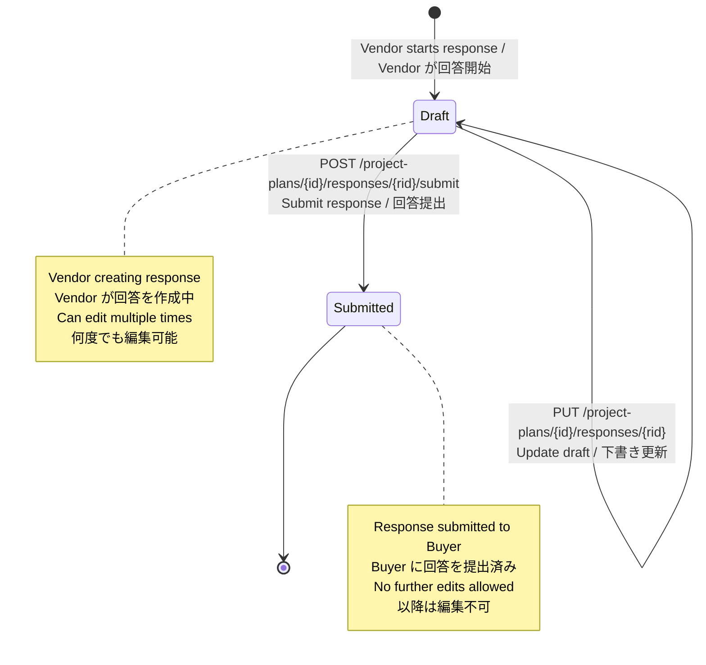

# 2. Projects Workflows / プロジェクトワークフロー

[← Back to Workflows Index / ワークフロー目次に戻る](./index.md)

---

## 2.1 Project State Transitions / プロジェクト状態遷移

**Constraints / 制約:**
- `Draft → InDiscussion`: Vendor selection required / Vendor選択必須
- `InDiscussion → Closed`: Manual only (no auto-close) / 手動のみ（自動クローズなし）
- Once `Closed`, cannot reopen / 一度 `Closed` になると再オープン不可

---

## 2.2 Project Plan Response State Transitions / プロジェクト計画書回答の状態遷移

---

## 2.3 API Summary / API一覧

### Project APIs

| Method | Endpoint | Actor | Description |
|--------|----------|-------|-------------|
| POST | `/projects` | Buyer | Create new project (Draft) |
| PUT | `/projects/{id}` | Buyer | Update project content |
| POST | `/projects/{id}/start-discussion` | Buyer | Start discussion with vendors |
| POST | `/projects/{id}/close` | Buyer | Close project |
| GET | `/projects` | Buyer/Vendor | List projects |
| GET | `/projects/{id}` | Buyer/Vendor | Get project details |

### Project Plan Response APIs

| Method | Endpoint | Actor | Description |
|--------|----------|-------|-------------|
| POST | `/project-plans/{id}/responses` | Vendor | Create response draft |
| PUT | `/project-plans/{id}/responses/{rid}` | Vendor | Update response |
| POST | `/project-plans/{id}/responses/{rid}/submit` | Vendor | Submit response |
| GET | `/project-plans/{id}/responses` | Buyer/Vendor | List responses |

---

[← Back to Workflows Index / ワークフロー目次に戻る](./index.md)
